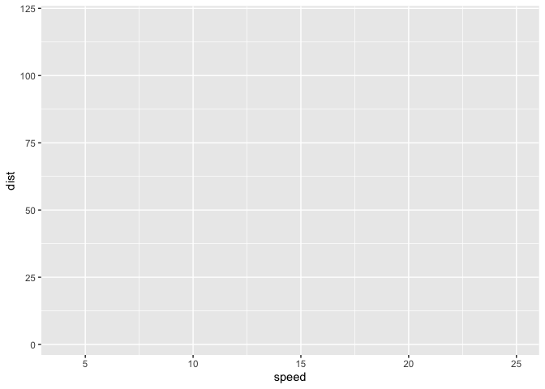

# Class 5: Data Visualization with ggplot
Andrew Quach (A12137777)

\##Using GGPLOT

To use ggplot2 we first need to install it on our computers. To do this
we will use the function `install.packages()`

Before I use any package functions I have to load them up with a
`library()` call, like so:

``` r
library(ggplot2)
head(cars)
```

      speed dist
    1     4    2
    2     4   10
    3     7    4
    4     7   22
    5     8   16
    6     9   10

``` r
cars
```

       speed dist
    1      4    2
    2      4   10
    3      7    4
    4      7   22
    5      8   16
    6      9   10
    7     10   18
    8     10   26
    9     10   34
    10    11   17
    11    11   28
    12    12   14
    13    12   20
    14    12   24
    15    12   28
    16    13   26
    17    13   34
    18    13   34
    19    13   46
    20    14   26
    21    14   36
    22    14   60
    23    14   80
    24    15   20
    25    15   26
    26    15   54
    27    16   32
    28    16   40
    29    17   32
    30    17   40
    31    17   50
    32    18   42
    33    18   56
    34    18   76
    35    18   84
    36    19   36
    37    19   46
    38    19   68
    39    20   32
    40    20   48
    41    20   52
    42    20   56
    43    20   64
    44    22   66
    45    23   54
    46    24   70
    47    24   92
    48    24   93
    49    24  120
    50    25   85

There is always the “base R” graphics system, i.e. `plot()`

``` r
plot(cars)
```


To use ggplot I need to spell out at least 3 sthing: -data(the stuff I
want to plot as a data.frame) -aes (aes() values - how the data map to
the plot) -geoms ( how I want things drawn)

``` r
ggplot(cars) +
  aes(x=speed, y=dist)
```



``` r
ggplot(cars) +
  aes(x=speed, y=dist) +
  geom_point()
```


``` r
ggplot(cars) +
  aes(x=speed, y=dist) + 
  geom_point() +
  geom_smooth(method="lm")
```

    `geom_smooth()` using formula = 'y ~ x'


``` r
ggplot(cars) +
  aes(x=speed, y=dist) + 
  geom_point() +
  geom_smooth(method="lm", se=FALSE)
```

    `geom_smooth()` using formula = 'y ~ x'


``` r
ggplot(cars) + 
  aes(x=speed, y=dist) +
  geom_point() +
  labs(title="Speed and Stopping Distances of Cars",
       x="Speed (MPH)", 
       y="Stopping Distance (ft)",
       subtitle = "Your informative subtitle text here",
       caption="Dataset: 'cars'") +
  geom_smooth(method="lm", se=FALSE) +
  theme_bw()
```

    `geom_smooth()` using formula = 'y ~ x'


``` r
url <- "https://bioboot.github.io/bimm143_S20/class-material/up_down_expression.txt"
genes <- read.delim(url)
head(genes)
```

            Gene Condition1 Condition2      State
    1      A4GNT -3.6808610 -3.4401355 unchanging
    2       AAAS  4.5479580  4.3864126 unchanging
    3      AASDH  3.7190695  3.4787276 unchanging
    4       AATF  5.0784720  5.0151916 unchanging
    5       AATK  0.4711421  0.5598642 unchanging
    6 AB015752.4 -3.6808610 -3.5921390 unchanging

``` r
nrow(genes)
```

    [1] 5196

``` r
colnames(genes)
```

    [1] "Gene"       "Condition1" "Condition2" "State"     

``` r
ncol(genes)
```

    [1] 4

``` r
table(genes$State)
```


          down unchanging         up 
            72       4997        127 

``` r
round ( table(genes$State)/nrow(genes) * 100, 2)
```


          down unchanging         up 
          1.39      96.17       2.44 

``` r
ggplot(genes) + 
  aes(Condition1, Condition2) + 
  geom_point()
```


``` r
p <- ggplot(genes) +
  aes(x=Condition1, y=Condition2, col=State) +
  geom_point()
p
```


``` r
p + scale_colour_manual( values=c("blue", "gray", "red") )
```


``` r
p + scale_colour_manual(values=c("blue", "gray", "red")) +
  labs(title="Gene Expression Changes Upon Drug Development", x="Control (no drug)", y="Drug Treatment")
```


``` r
url <- "https://raw.githubusercontent.com/jennybc/gapminder/master/inst/extdata/gapminder.tsv"

gapminder <- read.delim(url)
```

``` r
# install.packages("dplyr")  ## un-comment to install if needed
library(dplyr)
```


    Attaching package: 'dplyr'

    The following objects are masked from 'package:stats':

        filter, lag

    The following objects are masked from 'package:base':

        intersect, setdiff, setequal, union

``` r
gapminder_2007 <- gapminder %>% filter(year==2007)
```

``` r
ggplot(gapminder_2007) +
  aes(x=gdpPercap, y=lifeExp) + 
  geom_point()
```


``` r
ggplot(gapminder_2007) + 
  aes(x=gdpPercap, y=lifeExp) +
  geom_point(alpha=0.5)
```


``` r
ggplot(gapminder_2007) +
  aes(x = gdpPercap, y = lifeExp, color = pop) +
  geom_point(alpha=0.8)
```


``` r
ggplot(gapminder_2007) + 
  aes(x = gdpPercap, y = lifeExp, size = pop) +
  geom_point(alpha=0.5)
```


``` r
ggplot(gapminder_2007) + 
  geom_point(aes(x = gdpPercap, y = lifeExp,
                 size = pop), alpha=0.5) + 
  scale_size_area(max_size = 10)
```


``` r
gapminder_1957 <- gapminder %>% filter(year==1957)

ggplot(gapminder_1957) + 
  aes(x = gdpPercap, y = lifeExp, color=continent,
                 size = pop) +
  geom_point(alpha=0.7) + 
  scale_size_area(max_size = 10) 
```


``` r
gapminder_1957 <- gapminder %>% filter(year==1957 | year==2007)

ggplot(gapminder_1957) + 
  geom_point(aes(x = gdpPercap, y = lifeExp, color=continent,
                 size = pop), alpha=0.7) + 
  scale_size_area(max_size = 10) +
  facet_wrap(~year)
```


